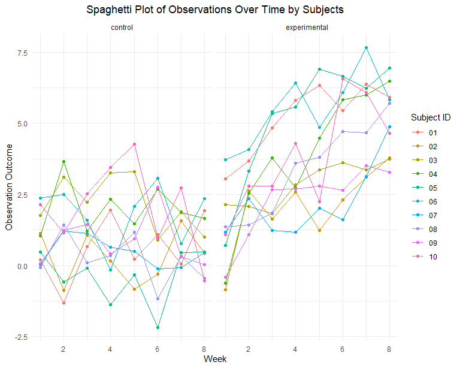
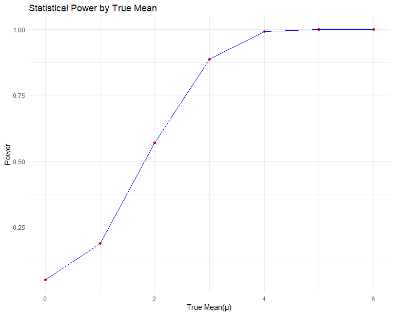

p8105_hw5_yw4251
================
You Wu
2023-11-12

# Problem 0

Load Necessary Packages.

``` r
library(tidyverse)
```

    ## ── Attaching core tidyverse packages ──────────────────────── tidyverse 2.0.0 ──
    ## ✔ dplyr     1.1.3     ✔ readr     2.1.4
    ## ✔ forcats   1.0.0     ✔ stringr   1.5.0
    ## ✔ ggplot2   3.4.3     ✔ tibble    3.2.1
    ## ✔ lubridate 1.9.2     ✔ tidyr     1.3.0
    ## ✔ purrr     1.0.2     
    ## ── Conflicts ────────────────────────────────────────── tidyverse_conflicts() ──
    ## ✖ dplyr::filter() masks stats::filter()
    ## ✖ dplyr::lag()    masks stats::lag()
    ## ℹ Use the conflicted package (<http://conflicted.r-lib.org/>) to force all conflicts to become errors

``` r
library(purrr)
library(ggridges)
```

# Problem 2

Load and tidy the dataset.

``` r
file_list = list.files(path = "data/",full.names = TRUE)
file_info_df = data.frame(file_name = file_list)

process_file = function(file_path) {
  parts = str_split(basename(file_path), "_|\\.")[[1]]
  arm = parts[1]
  subject_id = parts[2]

  data = read.csv(file_path) 

  data = mutate(data, subject_id = subject_id, arm = arm)

  return(data)
}

all_data = map_df(file_info_df$file_name, process_file)|>
  pivot_longer(
    week_1:week_8,
    names_to="week",
    values_to="outcome",
    names_prefix="week_"
  )|>
  mutate(
    week = as.numeric(week),
    arm=recode(arm, "con"="control", "exp"="experimental"),
    arm = as.factor(arm)           
  )

all_data
```

    ## # A tibble: 160 × 4
    ##    subject_id arm      week outcome
    ##    <chr>      <fct>   <dbl>   <dbl>
    ##  1 01         control     1    0.2 
    ##  2 01         control     2   -1.31
    ##  3 01         control     3    0.66
    ##  4 01         control     4    1.96
    ##  5 01         control     5    0.23
    ##  6 01         control     6    1.09
    ##  7 01         control     7    0.05
    ##  8 01         control     8    1.94
    ##  9 02         control     1    1.13
    ## 10 02         control     2   -0.88
    ## # ℹ 150 more rows

Make a spaghetti plot showing observations on each subject over time

``` r
ggplot(all_data, aes(x = week, y = outcome, group = subject_id, color = subject_id)) +
  geom_line() +
  geom_point(size=1.5)+
  theme_minimal() +
  facet_grid(~arm)+
  labs(
    title = "Spaghetti Plot of Observations Over Time by Subjects",
    x = "Week",
    y = "Observation Outcome",
    color = "Subject ID"
  ) 
```

<!-- -->

## *Differences between groups:*

**Trend**: The experimental group shows an increasing trend over time,
suggesting a possible treatment effect, while the control group’s trend
is not consistently upward.

**Cohesion**: Outcomes vary significantly among subjects in both groups.
The control group’s outcomes are more closely bunched together, in
contrast to the experimental group, where there’s a broader spread of
individual outcomes, suggesting a range of responses to the treatment.

**Time Change**: The distinction between the control and experimental
groups grows more evident around the fourth or fifth week, suggesting
this may be the period when the treatment begins to have a discernible
impact.

# Problem 3

Generate 5000 datasets when `mu=0`.

``` r
set.seed(1)
sim_mean_test <- function(mu,n=30, sigma = 5) {
  sim_data = tibble(
    x=rnorm(n=n, mean=mu, sd = sigma)
  )
  test_result = broom::tidy(t.test(sim_data$x, mu=mu))|>
    select(mu_hat=estimate,p.value)
  return(test_result)
}

sim_results_df_0 =   
  map(1:5000, \(i) sim_mean_test(0)) |> 
  bind_rows()

head(sim_results_df_0)
```

    ## # A tibble: 6 × 2
    ##   mu_hat p.value
    ##    <dbl>   <dbl>
    ## 1  0.412  0.629 
    ## 2  0.664  0.368 
    ## 3  0.551  0.534 
    ## 4  0.567  0.487 
    ## 5 -1.65   0.0599
    ## 6  1.19   0.229

``` r
sim_results_df_1_6 = 
  expand_grid(
    mu = 0:6,
    iter = 1:50
  )|> 
  mutate(
    estimate_df = map(mu, sim_mean_test)
  ) |> 
  unnest(estimate_df)

power_analysis=sim_results_df_1_6|>
  group_by(mu)|>
  summarise(
    power=mean(p.value<0.05),
    avg_mu_hat = mean(mu_hat),
    avg_mu_hat_rejected = mean(mu_hat[p.value < 0.05])
    )
```

``` r
power_analysis|>
  ggplot(aes(x=mu,y=power))+
  geom_point() +
  geom_line() +
  labs(title = "Power vs True Mean", x = "True Mean", y = "Power")
```

<!-- -->
